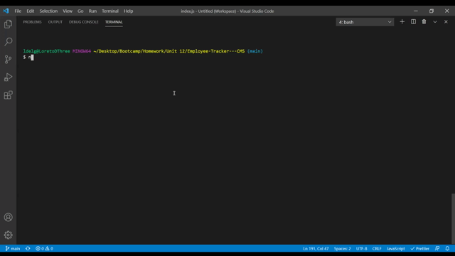

# Employee Tracker - CMS

## Descriptions

This Employee Tracker Application allows the user to view and update an existing database stored with team information. Using this app you are able to view all employees with their corresponding details like manager, role, department, etc., update an employees role, view departments within the company, and much more!

## Table of Contents

- [Installation](#installation)
- [Usage](#usage)
- [License](#license)
- [Credits](#contributing)
- [Tests](#tests)
- [Questions](#questions)

## Installation

Node is required for this application to work. The user must also install mysql and inquirer.

## Usage

In addition to running the application using npm start, the user must run the schema and seeds files within the database folder in mysql.

## License

This application is covered by the Creative Commons license.

## Contributing

There were no collaborators for this project.

## Tests

There are no tests for this project.

## Questions

If you have any questions please send an email to: ldelgadothethird@gmail.com or go to github at: https://github.com/ldelgadoIII
